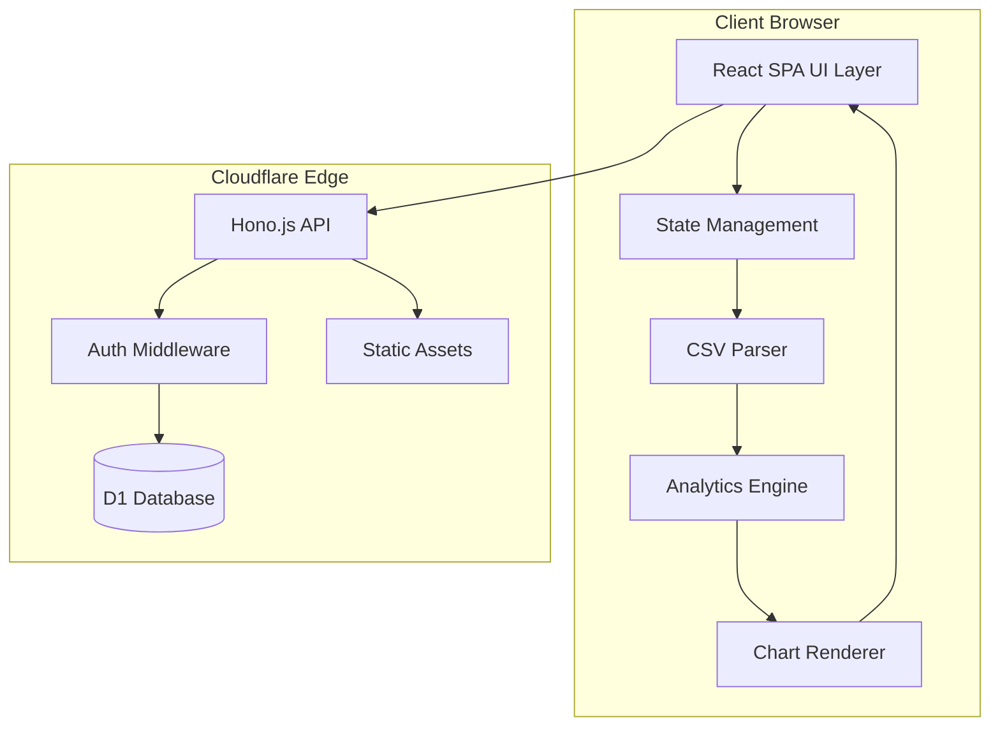
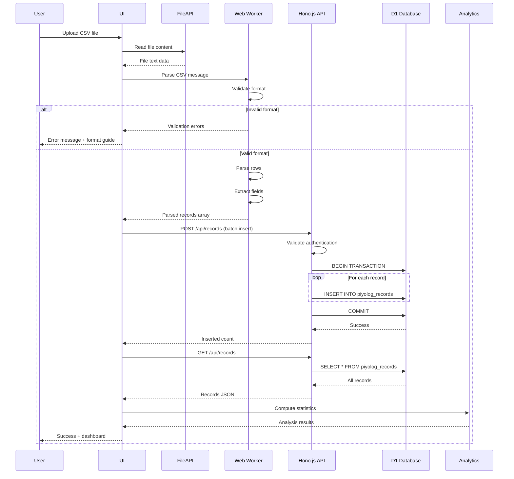
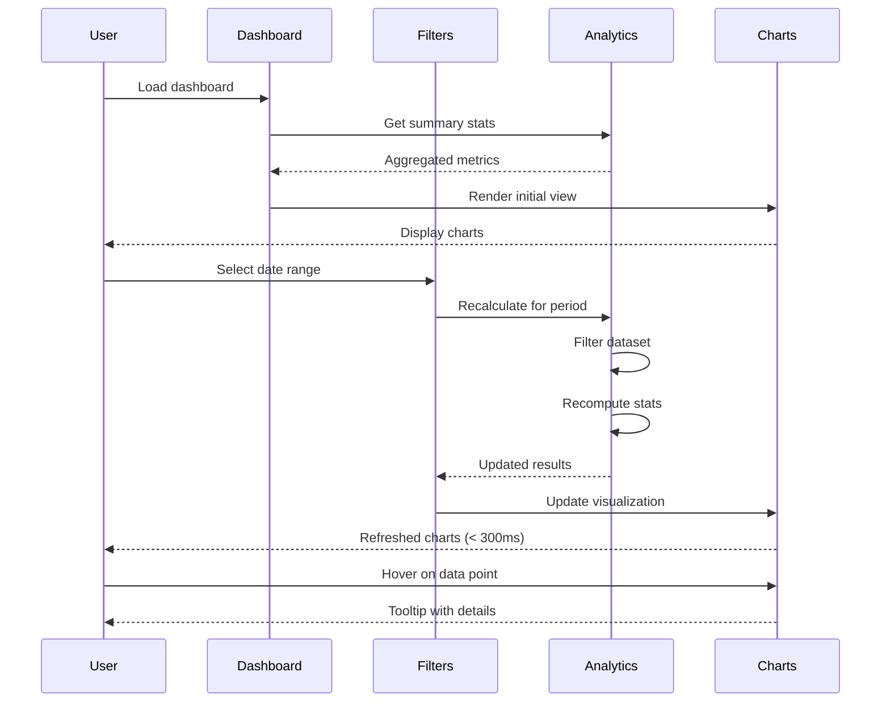
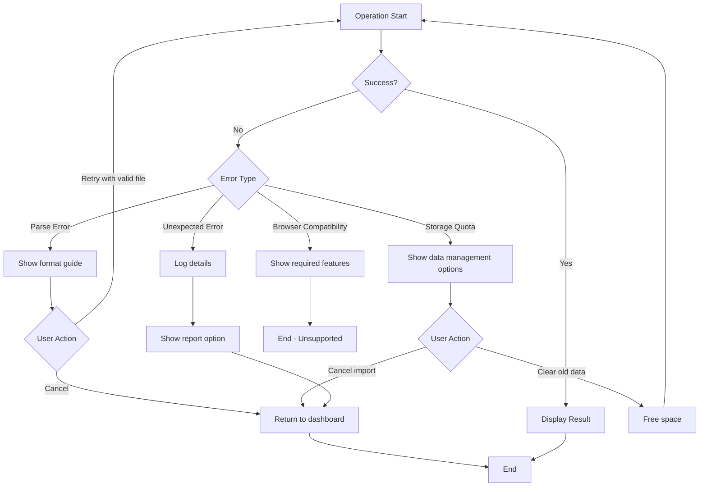
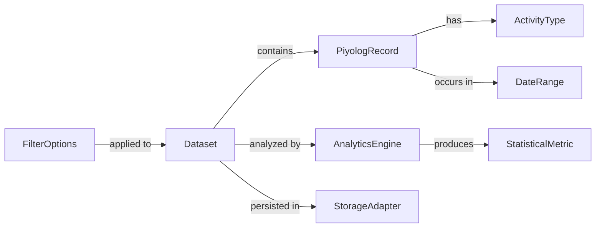

# Technical Design Document

## Overview

The Piyolog Dashboard is a single-page web application (SPA) that enables parents to import, analyze, and visualize data exported from the PiyoLog baby tracking mobile application. Built on Cloudflare Workers platform with Hono.js framework, TypeScript, and TailwindCSS, this application provides an interactive, responsive dashboard for understanding baby care patterns through statistical analysis and data visualization.

**Purpose**: This feature delivers comprehensive baby activity analysis and visualization capabilities to parents using the PiyoLog app, enabling them to gain insights from their baby tracking data through interactive charts and statistical summaries.

**Users**: Parents who use PiyoLog mobile application for tracking baby activities (feeding, sleeping, diaper changes, etc.) will utilize this dashboard for analyzing historical patterns, identifying trends, and making data-driven decisions about their baby's care routines.

**Impact**: Creates a new standalone web application providing analytics capabilities beyond the mobile app's built-in features, with secure multi-user data sharing via Cloudflare D1 database and simple access control.

### Goals

- Provide seamless PiyoLog data import with comprehensive validation and error handling
- Enable real-time statistical analysis and trend identification for baby activity patterns
- Deliver interactive, responsive visualizations accessible on desktop and mobile devices
- Ensure sub-second UI interactions and fast initial load times leveraging edge computing
- Support multi-user data sharing with simple password-based access control
- Maintain data persistence in Cloudflare D1 database within free tier limits

### Non-Goals

- Complex user account management with email verification or OAuth
- Real-time synchronization with PiyoLog mobile application
- Fine-grained permission systems (view-only, edit roles)
- Multi-tenancy with complete data isolation between families
- Integration with medical systems or health record platforms

## Architecture

### High-Level Architecture



### Architecture Integration

**Existing patterns preserved**: This is a greenfield project with no existing patterns to preserve.

**New components rationale**:
- **Cloudflare Workers + Hono.js**: Edge deployment with REST API capabilities for multi-user data access and simple authentication
- **Cloudflare D1**: Serverless SQLite database providing cost-effective shared data storage within generous free tier (100k reads/day, 1GB storage)
- **HTTP Basic Auth**: Simple password protection sufficient for family sharing without complex user management overhead
- **Client-side processing**: Data parsing and analysis occur in browser, minimizing server compute costs while maintaining responsive UI
- **Hybrid architecture**: Server stores data for sharing; client computes analytics for performance and cost efficiency

**Technology alignment**: Modern web standards-based architecture leveraging edge computing, Web APIs, and progressive enhancement principles.

**Steering compliance**: No existing steering documents; this design establishes foundational patterns for future development.

### Technology Stack and Design Decisions

#### Frontend Layer
- **Selection**: React 18+ with TypeScript
- **Rationale**: Component-based architecture with strong ecosystem support, excellent TypeScript integration, and broad browser compatibility
- **Alternatives Considered**:
  - Vue.js 3: Simpler learning curve but smaller ecosystem for charting libraries
  - Vanilla TypeScript: Better performance but significantly higher development time
- **Trade-offs**: React bundle size (~45KB gzipped) vs development velocity and maintainability

#### Styling Framework
- **Selection**: TailwindCSS 3+
- **Rationale**: Utility-first approach enables rapid UI development with minimal CSS overhead, excellent purging for production builds
- **Alternatives Considered**:
  - CSS Modules: More traditional but requires more custom CSS authoring
  - Styled Components: Runtime overhead incompatible with performance goals
- **Trade-offs**: HTML verbosity vs build-time optimization and zero runtime cost

#### Visualization Library
- **Selection**: react-chartjs-2 with Chart.js 4
- **Rationale**: Well-maintained React wrapper for Chart.js with comprehensive chart types, TypeScript support, and excellent performance characteristics
- **Alternatives Considered**:
  - Recharts: Pure React implementation but heavier bundle and slower rendering
  - D3.js: Maximum flexibility but steep learning curve and larger implementation effort
- **Trade-offs**: Less customization flexibility vs faster implementation and better performance

#### Edge Runtime
- **Selection**: Cloudflare Workers with Hono.js
- **Rationale**: Global edge deployment with minimal cold start times, Web Standards APIs, zero configuration scaling, native D1 integration
- **Alternatives Considered**:
  - Vercel Edge Functions: Similar capabilities but tighter platform coupling
  - Traditional Node.js hosting: Greater flexibility but higher latency and operational overhead
- **Trade-offs**: Runtime constraints (CPU limits, no filesystem) vs performance and cost efficiency

#### Database Layer
- **Selection**: Cloudflare D1 (SQLite-based serverless database)
- **Rationale**: Generous free tier (100k reads/day, 1GB storage), native Workers integration, SQL familiarity, automatic backups
- **Alternatives Considered**:
  - Cloudflare KV: Simpler but lacks relational queries needed for filtering/analytics
  - Cloudflare R2: Object storage unsuitable for structured record queries
  - External PostgreSQL: Higher cost, latency overhead from edge to external DB
- **Trade-offs**: SQLite limitations (single-writer, eventual consistency across regions) vs cost efficiency and simplicity

#### Authentication Layer
- **Selection**: HTTP Basic Authentication with password stored in Workers environment variable
- **Rationale**: Minimal implementation complexity, adequate security over HTTPS for family sharing use case
- **Alternatives Considered**:
  - Cloudflare Access: Enterprise-grade but overkill for simple family dashboard
  - OAuth 2.0: Complex integration, external dependencies, unnecessary for this scope
  - Custom JWT: More flexible but requires token management infrastructure
- **Trade-offs**: Limited to single shared password (no per-user accounts) vs implementation simplicity and zero additional infrastructure

#### Key Design Decisions

##### Decision 1: Hybrid Data Storage with Client-Side Analytics

**Decision**: Store raw records in Cloudflare D1 for multi-user sharing, but perform all CSV parsing, statistical analysis, and data transformation in the browser using Web Workers.

**Context**: Users require multi-device access and family sharing of baby tracking data. PiyoLog datasets range from hundreds to thousands of records requiring statistical computations. Cloudflare Workers CPU time is limited and billed beyond free tier.

**Alternatives**:
1. Full server-side processing: Parse, analyze, and store on Workers with D1
2. Pure client-side: Store in LocalStorage, no sharing capability
3. Hybrid: Store raw data in D1, compute analytics on client

**Selected Approach**: Hybrid architecture - D1 storage with client-side analytics (Alternative 3).

Implementation pattern:
- CSV parsing occurs in browser Web Worker
- Parsed records sent to Hono.js API for D1 storage via batch INSERT
- Dashboard fetches raw records from D1 API
- Client-side Analytics Engine computes statistics, trends, correlations
- Results cached in component state, recomputed on filter changes

**Rationale**:
- **Sharing**: D1 provides multi-user access without complex sync logic
- **Cost**: Client-side analytics avoids Workers CPU charges beyond free tier
- **Performance**: Modern browsers handle 10,000+ records efficiently; edge database queries remain fast
- **Scalability**: Database handles data management; client scales naturally per user

**Trade-offs**:
- **Gains**: Multi-user sharing, cost-effective computation, responsive analytics, free tier compliance
- **Sacrifices**: Initial data fetch latency, analytics recomputed per session (acceptable for small datasets), requires browser with adequate performance

##### Decision 2: D1 Database Schema Design

**Decision**: Use single normalized table for PiyoLog records with SQLite's built-in datetime functions for efficient filtering and aggregation.

**Context**: Dashboard needs to efficiently query records by date range, activity type, and support pagination for large datasets. D1 uses SQLite which excels at read-heavy workloads. Typical queries include "all feeding records in last 7 days" and "sleep duration averages by week".

**Alternatives**:
1. Single table with JSON column for flexible data: Simple schema but poor query performance
2. Normalized multi-table: Separate tables per activity type for type-specific fields
3. Single table with nullable columns: All activity types in one table with type-specific nullable columns

**Selected Approach**: Single table with nullable columns for activity-specific data (Alternative 3).

Schema design:
```sql
CREATE TABLE piyolog_records (
  id INTEGER PRIMARY KEY AUTOINCREMENT,
  timestamp TEXT NOT NULL,  -- ISO 8601 format for SQLite datetime functions
  activity_type TEXT NOT NULL,
  duration_minutes INTEGER,
  quantity_ml INTEGER,
  notes TEXT,
  imported_at TEXT NOT NULL,
  imported_filename TEXT
);

CREATE INDEX idx_timestamp ON piyolog_records(timestamp);
CREATE INDEX idx_activity_type ON piyolog_records(activity_type);
CREATE INDEX idx_timestamp_activity ON piyolog_records(timestamp, activity_type);
```

**Rationale**:
- **Query performance**: Indexes enable fast date range and activity type filtering
- **Simplicity**: Single table avoids complex JOINs for dashboard queries
- **Flexibility**: Nullable columns accommodate different activity types without schema changes
- **SQLite compatibility**: ISO 8601 timestamps leverage SQLite's datetime functions for aggregations

**Trade-offs**:
- **Gains**: Fast queries with indexes, simple API implementation, easy schema evolution, efficient bulk inserts
- **Sacrifices**: Some storage overhead from nullable columns, less type safety than multi-table approach (acceptable given validation in application layer)

##### Decision 3: Simple HTTP Basic Authentication

**Decision**: Implement HTTP Basic Authentication with single shared password stored in Workers environment variable for family access control.

**Context**: Users need simple access control for family sharing without complex user management. Authentication must work seamlessly with Hono.js middleware pattern. Security over HTTPS is adequate for non-critical baby tracking data within family trust boundary.

**Alternatives**:
1. HTTP Basic Auth: Browser-native, simple password prompt
2. Session-based auth: Cookies with login form, server-side session management
3. JWT tokens: Stateless tokens with refresh mechanism

**Selected Approach**: HTTP Basic Auth with Hono middleware (Alternative 1).

Implementation pattern:
```typescript
import { basicAuth } from 'hono/basic-auth'

app.use('/api/*', basicAuth({
  username: 'family',
  password: c.env.DASHBOARD_PASSWORD
}))
```

- Password configured via Wrangler environment variable
- Browser prompts for credentials on first API access
- Credentials cached by browser for subsequent requests
- All API routes protected; static assets publicly accessible

**Rationale**:
- **Simplicity**: Zero authentication infrastructure; browser handles credential management
- **Security**: HTTPS encryption protects credentials in transit; adequate for family use case
- **UX**: Single password shareable among family members via secure channel
- **Cost**: No authentication service costs or session storage overhead

**Trade-offs**:
- **Gains**: Minimal implementation, zero infrastructure, adequate security for use case, browser-native UX
- **Sacrifices**: No per-user accounts or audit trail, password change requires all users to re-authenticate, cannot revoke individual access (acceptable for trusted family sharing)

## System Flows

### Data Import and Processing Flow



### Dashboard Visualization Interaction Flow



### Error Recovery Process Flow



## Requirements Traceability

| Requirement | Requirement Summary | Components | Interfaces | Flows |
|-------------|---------------------|------------|------------|-------|
| 1.1-1.6 | Data Import | FileUploadComponent, CSVParser, RecordsAPI, D1APIClient | `parseCSV()`, `POST /api/records`, `batchInsertRecords()` | Data Import Flow |
| 2.1-2.5 | Data Analysis | AnalyticsEngine, StatisticsCalculator, TrendAnalyzer | `computeStats()`, `analyzeTrends()`, `findCorrelations()` | Processing Flow |
| 3.1-3.6 | Dashboard Visualization | DashboardView, ChartComponents, FilterControls | `renderChart()`, `applyFilters()`, `updateDateRange()` | Visualization Interaction |
| 4.1-4.5 | Data Persistence | RecordsAPI, D1 Database, D1APIClient | `GET /api/records`, `fetchAllRecords()`, `DELETE /api/records` | Data Import Flow (storage step) |
| 5.1-5.5 | UI Navigation | NavigationMenu, OnboardingFlow, MobileNavigation | `navigate()`, `preserveState()`, `showOnboarding()` | Dashboard Interaction |
| 6.1-6.5 | Performance | Web Workers, ProgressIndicator, D1 Batch Operations | `measurePerformance()`, `showProgress()`, `db.batch()` | All flows (cross-cutting) |
| 7.1-7.5 | Error Handling | ErrorBoundary, ErrorDisplay, ErrorLogger, D1APIClient | `handleError()`, `displayMessage()`, `handleHTTPError()` | Error Recovery Flow |

## Components and Interfaces

### Presentation Layer

#### DashboardView

**Responsibility & Boundaries**
- **Primary Responsibility**: Orchestrate dashboard UI, coordinate between data, filters, and visualizations
- **Domain Boundary**: Presentation layer - no business logic or data processing
- **Data Ownership**: UI state (active filters, selected date ranges, view preferences)
- **Transaction Boundary**: Single user session scope

**Dependencies**
- **Inbound**: Application root component
- **Outbound**: ChartComponents, FilterControls, StatisticsDisplay, NavigationMenu
- **External**: react, react-chartjs-2

**Contract Definition - Component Props Interface**

```typescript
interface DashboardViewProps {
  data: AnalyzedData | null;
  onFilterChange: (filters: FilterOptions) => void;
  onDateRangeChange: (range: DateRange) => void;
}

interface FilterOptions {
  activityTypes: ActivityType[];
  dateRange: DateRange;
  sortBy: SortOption;
}

interface DateRange {
  startDate: Date;
  endDate: Date;
}

type ActivityType = 'feeding' | 'sleeping' | 'diaper' | 'temperature' | 'weight' | 'height';
type SortOption = 'date' | 'frequency' | 'duration';
```

**Preconditions**: DashboardView receives parsed and analyzed data; null indicates no data imported yet
**Postconditions**: Renders interactive dashboard or onboarding screen; filter changes trigger parent re-analysis
**Invariants**: Component remains responsive during data updates; accessibility attributes maintained

#### FileUploadComponent

**Responsibility & Boundaries**
- **Primary Responsibility**: Handle file selection, validate file type/size, trigger parsing workflow
- **Domain Boundary**: UI interaction and file validation only; delegates parsing to service layer
- **Data Ownership**: Temporary file reference until parsing initiated
- **Transaction Boundary**: Single file upload operation

**Dependencies**
- **Inbound**: Import page or modal trigger
- **Outbound**: CSVParser service, ErrorDisplay
- **External**: Browser File API

**Contract Definition - Component Interface**

```typescript
interface FileUploadComponentProps {
  onFileSelected: (file: File) => void;
  onParseComplete: (result: ParseResult) => void;
  onError: (error: FileUploadError) => void;
  acceptedFormats: string[]; // ['.csv', 'text/csv']
  maxSizeBytes: number;
}

interface ParseResult {
  records: PiyologRecord[];
  recordCount: number;
  parseErrors: ParseError[];
  metadata: FileMetadata;
}

interface FileUploadError {
  type: 'INVALID_FORMAT' | 'FILE_TOO_LARGE' | 'PARSE_ERROR' | 'BROWSER_API_ERROR';
  message: string;
  details?: unknown;
}

interface FileMetadata {
  fileName: string;
  fileSize: number;
  importedAt: Date;
}
```

**Preconditions**: User has file access; browser supports File API
**Postconditions**: Valid file triggers parsing; errors display user-friendly messages with recovery guidance
**Invariants**: Upload UI remains accessible during processing; progress indication provided for large files

#### ChartComponents

**Responsibility & Boundaries**
- **Primary Responsibility**: Render interactive charts using processed analytics data with Chart.js/react-chartjs-2
- **Domain Boundary**: Visualization presentation only; consumes pre-processed chart data
- **Data Ownership**: Chart rendering state and interaction state (zoom, pan, hover)
- **Transaction Boundary**: Single chart render lifecycle

**Dependencies**
- **Inbound**: DashboardView, AnalyticsEngine output
- **Outbound**: None (leaf component)
- **External**: chart.js, react-chartjs-2

**External Dependencies Investigation**:

**react-chartjs-2**:
- **Version**: 5.x (compatible with Chart.js 4.x)
- **API Signatures**:
  ```typescript
  import { Line, Bar, Doughnut } from 'react-chartjs-2';
  // Components accept data and options props with full TypeScript support
  <Line data={chartData} options={chartOptions} />
  ```
- **TypeScript Support**: Full type definitions via `@types/react-chartjs-2` and Chart.js types
- **Performance**: Supports canvas-based rendering; handles 1000+ data points efficiently with decimation plugin
- **Configuration**: Requires Chart.js element registration before use:
  ```typescript
  import { Chart as ChartJS, CategoryScale, LinearScale, PointElement, LineElement } from 'chart.js';
  ChartJS.register(CategoryScale, LinearScale, PointElement, LineElement);
  ```

**Contract Definition - Chart Component Interface**

```typescript
interface TimeSeriesChartProps {
  data: ChartData<'line'>;
  options?: ChartOptions<'line'>;
  height?: number;
  width?: number;
  onDataPointClick?: (point: DataPoint) => void;
}

interface FrequencyBarChartProps {
  data: ChartData<'bar'>;
  options?: ChartOptions<'bar'>;
  height?: number;
  width?: number;
}

interface StatsSummaryProps {
  statistics: SummaryStatistics;
  comparisonPeriod?: DateRange;
}

// Chart.js type imports
import type { ChartData, ChartOptions } from 'chart.js';
```

**Preconditions**: Chart.js elements registered; data structure matches Chart.js format
**Postconditions**: Interactive charts render within 300ms; tooltips display on hover
**Invariants**: Charts remain responsive during data updates; accessibility labels provided

### API Layer

#### RecordsAPI

**Responsibility & Boundaries**
- **Primary Responsibility**: Provide REST API endpoints for CRUD operations on PiyoLog records in D1 database
- **Domain Boundary**: API layer between client and database; handles authentication, validation, and data access
- **Data Ownership**: Manages persistence of PiyologRecord entities in D1
- **Transaction Boundary**: Database transaction per API request

**Dependencies**
- **Inbound**: Client-side DataStore via fetch API
- **Outbound**: Cloudflare D1 database binding
- **External**: Hono.js framework, hono/basic-auth middleware

**External Dependencies Investigation**:

**Cloudflare D1 with Hono.js**:
- **Access Pattern**: Database binding available via `c.env.DB` in Hono context
- **TypeScript Binding**:
  ```typescript
  type Bindings = {
    DB: D1Database;
    DASHBOARD_PASSWORD: string;
  };
  ```
- **Prepared Statements**:
  ```typescript
  const { results } = await c.env.DB.prepare(
    "SELECT * FROM piyolog_records WHERE timestamp >= ?"
  ).bind(startDate).all();
  ```
- **Batch Operations**: D1 supports batch inserts via `db.batch()` for efficient bulk operations
- **Error Handling**: D1 errors include message property; use try-catch for graceful handling

**Contract Definition - REST API Interface**

```typescript
// POST /api/records - Batch insert records
interface BatchInsertRequest {
  records: PiyologRecord[];
}

interface BatchInsertResponse {
  insertedCount: number;
  errors: RecordError[];
}

// GET /api/records - Fetch all records (with optional filters)
interface GetRecordsQuery {
  startDate?: string; // ISO 8601
  endDate?: string;
  activityType?: ActivityType;
  limit?: number;
  offset?: number;
}

interface GetRecordsResponse {
  records: PiyologRecord[];
  totalCount: number;
}

// DELETE /api/records - Clear all records
interface DeleteRecordsResponse {
  deletedCount: number;
}

// GET /api/records/stats - Get summary statistics
interface StatsResponse {
  totalRecords: number;
  dateRange: DateRange;
  activityTypeCounts: Record<ActivityType, number>;
  oldestRecord: string;
  newestRecord: string;
}
```

**Hono.js Route Implementation Pattern**:

```typescript
import { Hono } from 'hono';
import { basicAuth } from 'hono/basic-auth';

type Bindings = {
  DB: D1Database;
  DASHBOARD_PASSWORD: string;
};

const app = new Hono<{ Bindings: Bindings }>();

// Authentication middleware for all API routes
app.use('/api/*', basicAuth({
  username: 'family',
  password: (c) => c.env.DASHBOARD_PASSWORD
}));

// Batch insert records
app.post('/api/records', async (c) => {
  const { records } = await c.req.json<BatchInsertRequest>();

  const statements = records.map(record =>
    c.env.DB.prepare(
      'INSERT INTO piyolog_records (timestamp, activity_type, duration_minutes, quantity_ml, notes, imported_at, imported_filename) VALUES (?, ?, ?, ?, ?, ?, ?)'
    ).bind(record.timestamp, record.activityType, record.duration, record.quantity, record.notes, record.importedAt, record.filename)
  );

  const results = await c.env.DB.batch(statements);
  return c.json({ insertedCount: results.length });
});

// Get all records
app.get('/api/records', async (c) => {
  const { results } = await c.env.DB.prepare(
    'SELECT * FROM piyolog_records ORDER BY timestamp DESC'
  ).all();

  return c.json({ records: results, totalCount: results.length });
});
```

**Preconditions**: D1 database initialized with schema; DASHBOARD_PASSWORD environment variable configured
**Postconditions**: API returns JSON responses; errors return appropriate HTTP status codes with error messages
**Invariants**: All API routes protected by authentication; database transactions atomic

**State Management**: Stateless API; all state in D1 database

### Data Processing Layer

#### CSVParser

**Responsibility & Boundaries**
- **Primary Responsibility**: Parse PiyoLog CSV exports into structured data objects with validation
- **Domain Boundary**: Data transformation layer between file input and domain models
- **Data Ownership**: Temporary parsing state; outputs immutable domain objects
- **Transaction Boundary**: Single file parsing operation

**Dependencies**
- **Inbound**: FileUploadComponent, DataImportService
- **Outbound**: DataValidator, ErrorLogger
- **External**: csv-parse library (browser-compatible CSV parser)

**External Dependencies Investigation**:

**csv-parse (browser build)**:
- **Version**: 5.x (browser-compatible ESM build)
- **API**:
  ```typescript
  import { parse } from 'csv-parse/browser/esm';
  const records = parse(csvString, {
    columns: true, // Use header row for field names
    skip_empty_lines: true,
    cast: true // Auto-cast types
  });
  ```
- **Alternative**: PapaParse (more browser-focused, better documentation, similar performance)
- **Performance**: Handles 10,000 rows in <500ms on modern browsers
- **Error Handling**: Provides line-level error information for partial import support

**Requires investigation during implementation**: PiyoLog exact CSV column names and format variations across app versions

**Contract Definition - Service Interface**

```typescript
interface CSVParserService {
  parseCSV(fileContent: string): Result<ParsedData, ParseError[]>;
  validateFormat(fileContent: string): Result<FormatValidation, ValidationError>;
  extractMetadata(fileContent: string): FileMetadata;
}

interface ParsedData {
  records: PiyologRecord[];
  metadata: DatasetMetadata;
  warnings: ParseWarning[];
}

interface PiyologRecord {
  timestamp: Date;
  activityType: ActivityType;
  duration?: number; // minutes
  quantity?: number; // ml for feeding
  notes?: string;
  metadata: RecordMetadata;
}

interface DatasetMetadata {
  recordCount: number;
  dateRange: DateRange;
  activityTypeCounts: Record<ActivityType, number>;
  version?: string; // PiyoLog export format version if detectable
}

type Result<T, E> = { success: true; data: T } | { success: false; errors: E };

interface ParseError {
  line: number;
  field: string;
  value: string;
  reason: string;
}

interface ParseWarning {
  line: number;
  message: string;
  severity: 'low' | 'medium' | 'high';
}
```

**Preconditions**: File content is valid UTF-8 text; CSV format follows PiyoLog export structure
**Postconditions**: Returns parsed records with line-level error information; partial success supported
**Invariants**: Original file content never modified; parsing errors do not throw exceptions

#### AnalyticsEngine

**Responsibility & Boundaries**
- **Primary Responsibility**: Compute statistical analysis, trend identification, and correlations from parsed data
- **Domain Boundary**: Core business logic for data analysis and insights generation
- **Data Ownership**: Analysis results and computed metrics
- **Transaction Boundary**: Single analysis operation per dataset or filtered subset

**Dependencies**
- **Inbound**: DashboardView (via filter changes), DataStore
- **Outbound**: None (pure computation)
- **External**: date-fns (date manipulation), lodash (statistical utilities)

**Contract Definition - Service Interface**

```typescript
interface AnalyticsEngineService {
  computeStatistics(records: PiyologRecord[], filters: FilterOptions): SummaryStatistics;
  analyzeTrends(records: PiyologRecord[], minimumDays: number): TrendAnalysis;
  findCorrelations(records: PiyologRecord[]): CorrelationResult[];
  identifyOutliers(records: PiyologRecord[]): OutlierResult[];
}

interface SummaryStatistics {
  activityStats: Map<ActivityType, ActivityStatistics>;
  overallMetrics: OverallMetrics;
  periodComparison?: PeriodComparison;
}

interface ActivityStatistics {
  activityType: ActivityType;
  totalCount: number;
  averageDuration?: number;
  averageQuantity?: number;
  frequency: FrequencyDistribution;
  timeOfDayDistribution: HourlyDistribution;
}

interface TrendAnalysis {
  trends: TrendResult[];
  confidence: number; // 0-1 confidence score
  periodAnalyzed: DateRange;
}

interface TrendResult {
  activityType: ActivityType;
  metric: 'frequency' | 'duration' | 'quantity';
  direction: 'increasing' | 'decreasing' | 'stable';
  magnitude: number; // percentage change
  significance: 'low' | 'medium' | 'high';
}

interface CorrelationResult {
  activity1: ActivityType;
  activity2: ActivityType;
  correlationType: 'positive' | 'negative' | 'none';
  strength: number; // 0-1
  confidence: number; // 0-1
  insights: string[]; // Human-readable findings
}

interface OutlierResult {
  record: PiyologRecord;
  metric: string;
  expectedValue: number;
  actualValue: number;
  deviation: number;
  severity: 'low' | 'medium' | 'high';
}
```

**Preconditions**: Minimum 7 days of data for trend analysis; records contain valid timestamps
**Postconditions**: Returns analysis results within 3 seconds for datasets up to 10,000 records
**Invariants**: Analysis functions are pure (no side effects); results deterministic for same input

**State Management**: Stateless service; all computation from input parameters

#### D1APIClient

**Responsibility & Boundaries**
- **Primary Responsibility**: Client-side wrapper for RecordsAPI endpoints with error handling and request retry logic
- **Domain Boundary**: Infrastructure layer abstracting HTTP communication with API
- **Data Ownership**: Temporary request/response data; manages HTTP auth credentials
- **Transaction Boundary**: Single HTTP request/response cycle

**Dependencies**
- **Inbound**: DataStore component
- **Outbound**: RecordsAPI via fetch(), ErrorLogger
- **External**: Browser Fetch API

**Contract Definition - Service Interface**

```typescript
interface D1APIClientService {
  batchInsertRecords(records: PiyologRecord[]): Promise<Result<BatchInsertResponse, APIError>>;
  fetchAllRecords(filters?: GetRecordsQuery): Promise<Result<PiyologRecord[], APIError>>;
  deleteAllRecords(): Promise<Result<number, APIError>>;
  getStats(): Promise<Result<StatsResponse, APIError>>;
}

interface APIError {
  type: 'NETWORK_ERROR' | 'AUTH_ERROR' | 'SERVER_ERROR' | 'VALIDATION_ERROR' | 'TIMEOUT';
  message: string;
  statusCode?: number;
  retryable: boolean;
}

type Result<T, E> = { success: true; data: T } | { success: false; error: E };
```

**Implementation Pattern**:

```typescript
class D1APIClient implements D1APIClientService {
  private baseURL: string;
  private timeout: number = 30000; // 30 seconds

  async batchInsertRecords(records: PiyologRecord[]): Promise<Result<BatchInsertResponse, APIError>> {
    try {
      const response = await fetch(`${this.baseURL}/api/records`, {
        method: 'POST',
        headers: { 'Content-Type': 'application/json' },
        body: JSON.stringify({ records }),
        signal: AbortSignal.timeout(this.timeout)
      });

      if (!response.ok) {
        return {
          success: false,
          error: this.handleHTTPError(response)
        };
      }

      const data = await response.json();
      return { success: true, data };
    } catch (err) {
      return {
        success: false,
        error: this.handleNetworkError(err)
      };
    }
  }

  async fetchAllRecords(filters?: GetRecordsQuery): Promise<Result<PiyologRecord[], APIError>> {
    const queryString = filters ? `?${new URLSearchParams(filters as any)}` : '';

    try {
      const response = await fetch(`${this.baseURL}/api/records${queryString}`);

      if (!response.ok) {
        return { success: false, error: this.handleHTTPError(response) };
      }

      const { records } = await response.json();
      return { success: true, data: records };
    } catch (err) {
      return { success: false, error: this.handleNetworkError(err) };
    }
  }

  private handleHTTPError(response: Response): APIError {
    if (response.status === 401) {
      return {
        type: 'AUTH_ERROR',
        message: 'Authentication failed. Please check your password.',
        statusCode: 401,
        retryable: false
      };
    }
    // ... other error handling
  }

  private handleNetworkError(err: unknown): APIError {
    if (err instanceof DOMException && err.name === 'AbortError') {
      return {
        type: 'TIMEOUT',
        message: 'Request timed out',
        retryable: true
      };
    }
    // ... other error handling
  }
}
```

**Preconditions**: API endpoint available; user authenticated (browser caches Basic Auth credentials)
**Postconditions**: Returns typed Result with success/error; network errors handled gracefully
**Invariants**: Never throws exceptions; always returns Result type; retryable errors flagged

**State Management**: Stateless client; credentials managed by browser

### Application Layer

#### DataStore

**Responsibility & Boundaries**
- **Primary Responsibility**: Manage application data state, coordinate between API client, CSV parsing, and analytics processing
- **Domain Boundary**: Application state management and data lifecycle coordination
- **Data Ownership**: Current application state including fetched records, computed analytics, and UI state
- **Transaction Boundary**: Application session scope

**Dependencies**
- **Inbound**: All UI components requiring data access
- **Outbound**: D1APIClient, AnalyticsEngine, CSVParser (Web Worker)
- **External**: zustand (state management) or React Context

**Contract Definition - State Management Interface**

```typescript
interface DataStoreState {
  // Data state
  rawData: PiyologRecord[] | null;
  analyzedData: AnalyzedData | null;
  metadata: DatasetMetadata | null;

  // UI state
  filters: FilterOptions;
  dateRange: DateRange;
  isLoading: boolean;
  error: AppError | null;

  // Actions
  importData: (file: File) => Promise<void>;
  fetchRecords: () => Promise<void>;
  clearData: () => Promise<void>;
  updateFilters: (filters: Partial<FilterOptions>) => void;
  updateDateRange: (range: DateRange) => void;
  recomputeAnalytics: () => void;
}

interface AnalyzedData {
  statistics: SummaryStatistics;
  trends: TrendAnalysis;
  correlations: CorrelationResult[];
  outliers: OutlierResult[];
  chartData: ChartDatasets;
}

interface ChartDatasets {
  timeSeriesData: ChartData<'line'>;
  frequencyData: ChartData<'bar'>;
  distributionData: ChartData<'doughnut'>;
}

interface AppError {
  type: ErrorType;
  message: string;
  recoveryOptions: RecoveryAction[];
  details?: unknown;
}

type ErrorType = 'PARSE_ERROR' | 'API_ERROR' | 'ANALYSIS_ERROR' | 'BROWSER_COMPATIBILITY' | 'AUTH_ERROR';
type RecoveryAction = 'RETRY' | 'CLEAR_DATA' | 'CONTACT_SUPPORT' | 'CHECK_FORMAT' | 'CHECK_PASSWORD';
```

**Action Implementation Flow**:

```typescript
// importData: Parse CSV → Send to API → Fetch updated records → Compute analytics
async importData(file: File) {
  setLoading(true);

  // Step 1: Parse CSV in Web Worker
  const parseResult = await csvParser.parseCSV(file);
  if (!parseResult.success) {
    setError(parseResult.error);
    return;
  }

  // Step 2: Batch insert to D1 via API
  const insertResult = await apiClient.batchInsertRecords(parseResult.data);
  if (!insertResult.success) {
    setError(insertResult.error);
    return;
  }

  // Step 3: Fetch all records to get updated dataset
  await fetchRecords();
}

// fetchRecords: Load data from D1 → Compute analytics
async fetchRecords() {
  const result = await apiClient.fetchAllRecords();
  if (result.success) {
    set({ rawData: result.data });
    recomputeAnalytics();
  }
}
```

**Preconditions**: Browser environment initialized; D1APIClient configured with endpoint
**Postconditions**: State changes trigger React re-renders; async operations update loading state
**Invariants**: State updates atomic; error state never leaves application in inconsistent state

**State Management**: Centralized state using Zustand or React Context with reducers

## Data Models

### Domain Model

**Core Concepts**:

**Entities**:
- **Dataset**: Represents imported PiyoLog data collection with metadata and lifecycle
- **PiyologRecord**: Individual baby activity record with timestamp and type-specific data

**Value Objects**:
- **ActivityType**: Enumeration of trackable activities (feeding, sleeping, diaper, etc.)
- **DateRange**: Immutable time period specification
- **StatisticalMetric**: Computed numerical values (averages, frequencies, trends)
- **FilterOptions**: Immutable filter configuration

**Domain Events**:
- **DataImported**: Triggered when new dataset successfully imported
- **AnalysisCompleted**: Fired when analytics computation finishes
- **FiltersApplied**: Emitted when user modifies filter criteria
- **DataCleared**: Triggered when user clears stored data

**Business Rules & Invariants**:
- Records must have valid timestamps within reasonable date ranges (not future dates)
- Duration and quantity values must be non-negative
- Trend analysis requires minimum 7 days of data across date range
- Correlation analysis requires minimum 2 activity types with overlapping time periods
- Filter applications preserve original dataset integrity (non-destructive)



### Logical Data Model

**Structure Definition**:

**PiyologRecord Entity**:
- **Attributes**: id (string), timestamp (Date), activityType (ActivityType), duration (number?), quantity (number?), notes (string?), metadata (object)
- **Natural Keys**: Combination of timestamp + activityType + metadata.source (for duplicate detection)
- **Referential Integrity**: Records belong to single Dataset; no cross-dataset relationships

**Dataset Entity**:
- **Attributes**: id (string), createdAt (Date), recordCount (number), dateRange (DateRange), version (string?)
- **Natural Keys**: Import timestamp (createdAt)
- **Integrity Rules**: Cascade delete records when dataset cleared

**AnalysisResult Value Object**:
- **Attributes**: computedAt (Date), filters (FilterOptions), statistics (SummaryStatistics), trends (TrendAnalysis[])
- **Integrity**: Results reference specific dataset version for cache invalidation

**Consistency & Integrity**:
- **Transaction boundaries**: Import operation is atomic (all records imported or none); analysis computation is eventual (async)
- **Cascading rules**: Clearing dataset clears all derived analysis results
- **Temporal aspects**: Records immutable after import; analysis results cached with timestamp for invalidation

### Physical Data Model

**For Cloudflare D1 (SQLite)**:

**Database Schema**:

```sql
-- Main records table
CREATE TABLE piyolog_records (
  id INTEGER PRIMARY KEY AUTOINCREMENT,
  timestamp TEXT NOT NULL,           -- ISO 8601 format: "2025-10-01T14:30:00Z"
  activity_type TEXT NOT NULL,        -- "feeding", "sleeping", "diaper", etc.
  duration_minutes INTEGER,           -- Nullable: only for activities with duration
  quantity_ml INTEGER,                -- Nullable: only for feeding activities
  notes TEXT,                         -- Optional user notes
  imported_at TEXT NOT NULL,          -- Import timestamp for tracking
  imported_filename TEXT              -- Source file name for reference
);

-- Performance indexes
CREATE INDEX idx_timestamp ON piyolog_records(timestamp);
CREATE INDEX idx_activity_type ON piyolog_records(activity_type);
CREATE INDEX idx_timestamp_activity ON piyolog_records(timestamp, activity_type);
CREATE INDEX idx_imported_at ON piyolog_records(imported_at);
```

**Type Mapping (D1 SQLite → TypeScript)**:

```typescript
interface D1PiyologRecord {
  id: number;
  timestamp: string;              // ISO 8601 string
  activity_type: string;          // ActivityType enum as string
  duration_minutes: number | null;
  quantity_ml: number | null;
  notes: string | null;
  imported_at: string;
  imported_filename: string | null;
}

// Conversion helper
function fromD1Record(d1Record: D1PiyologRecord): PiyologRecord {
  return {
    id: d1Record.id,
    timestamp: new Date(d1Record.timestamp),
    activityType: d1Record.activity_type as ActivityType,
    duration: d1Record.duration_minutes ?? undefined,
    quantity: d1Record.quantity_ml ?? undefined,
    notes: d1Record.notes ?? undefined,
    metadata: {
      importedAt: new Date(d1Record.imported_at),
      importedFilename: d1Record.imported_filename ?? undefined
    }
  };
}
```

**Query Patterns**:

```sql
-- Fetch all records (dashboard load)
SELECT * FROM piyolog_records ORDER BY timestamp DESC;

-- Fetch filtered by date range
SELECT * FROM piyolog_records
WHERE timestamp >= ? AND timestamp <= ?
ORDER BY timestamp DESC;

-- Fetch filtered by activity type
SELECT * FROM piyolog_records
WHERE activity_type = ? AND timestamp >= ?
ORDER BY timestamp DESC;

-- Get summary statistics (used for metadata API)
SELECT
  COUNT(*) as total_records,
  MIN(timestamp) as oldest_record,
  MAX(timestamp) as newest_record,
  activity_type,
  COUNT(*) as type_count
FROM piyolog_records
GROUP BY activity_type;

-- Batch insert (using D1 batch API)
-- Executed via db.batch([stmt1, stmt2, ...])
INSERT INTO piyolog_records
  (timestamp, activity_type, duration_minutes, quantity_ml, notes, imported_at, imported_filename)
VALUES (?, ?, ?, ?, ?, ?, ?);

-- Delete all records (reset dashboard)
DELETE FROM piyolog_records;
```

**Storage Strategy**:
- **Capacity**: D1 free tier provides 1GB storage (sufficient for years of baby tracking data)
- **Consistency**: Single-writer model ensures atomic transactions; eventually consistent across edge locations
- **Backup**: Cloudflare provides automatic backups; no manual backup strategy needed
- **Data Retention**: No automatic expiration; user explicitly manages via delete operations

**Performance Optimizations**:
- **Indexes**: Multi-column index on (timestamp, activity_type) for filtered dashboard queries
- **Batch Operations**: Use D1 batch API for bulk inserts (import) to minimize round trips
- **Pagination**: Support LIMIT/OFFSET for future large dataset handling
- **Edge Caching**: D1 read queries cached at edge; writes invalidate cache automatically

## Error Handling

### Error Strategy

The application implements comprehensive error handling with clear user guidance and recovery options. Errors are categorized by source and severity, with appropriate handling mechanisms for each category.

### Error Categories and Responses

**User Errors (Input Validation)**:
- **Invalid file format**: Display format guide showing expected CSV structure with PiyoLog example; offer retry with different file
- **File too large**: Show current size vs limit; suggest data range export from PiyoLog to reduce size
- **Incomplete data**: Highlight missing required fields; allow partial import of valid records with warnings

**System Errors (API/Network)**:
- **Authentication failure (401)**: Display password prompt; explain credentials required for family access; provide password change instructions
- **Network connection error**: Display offline message; offer retry when connection restored; cache last successful data load
- **API timeout**: Show timeout message with retry option; suggest checking network connection
- **Server error (500)**: Display generic error with retry; log details for debugging; provide status page link if available
- **Browser compatibility**: Feature detection for required APIs (Fetch, Web Workers); show specific missing features and recommended browsers

**Processing Errors (Analysis)**:
- **Insufficient data for analysis**: Explain minimum requirements (e.g., 7 days for trends); show current data span
- **Computation timeout**: Offer to cancel long-running analysis; suggest filtering data to smaller subset
- **Unexpected data patterns**: Log anomalies; display best-effort results with warnings about data quality

### Error Handling Pattern

```typescript
interface ErrorHandler {
  handleError(error: AppError, context: ErrorContext): ErrorResponse;
  logError(error: AppError, context: ErrorContext): void;
  recoverFromError(error: AppError, action: RecoveryAction): Promise<void>;
}

interface ErrorContext {
  component: string;
  operation: string;
  userAction: string;
  timestamp: Date;
}

interface ErrorResponse {
  displayMessage: string;
  technicalDetails?: string;
  recoveryOptions: RecoveryOption[];
  severity: 'info' | 'warning' | 'error' | 'critical';
}

interface RecoveryOption {
  label: string;
  action: RecoveryAction;
  description: string;
}
```

**Error Boundary Implementation**:
- React Error Boundaries wrap major component trees (Dashboard, Import, Settings)
- Errors caught at boundary trigger fallback UI with recovery options
- Unhandled errors logged with context for debugging

**Retry Logic**:
- Network operations: Exponential backoff not applicable (static site, no API calls)
- File parsing: User-initiated retry after format correction
- Analysis computation: Automatic retry once on timeout, then user-prompted

### Monitoring

**Error Tracking**:
- Console logging in development with full stack traces
- Structured error logging to browser console in production (no external services)
- Error frequency tracking in session storage for pattern detection

**Logging Strategy**:
```typescript
interface LogEntry {
  timestamp: Date;
  level: 'debug' | 'info' | 'warn' | 'error';
  category: 'PARSE' | 'STORAGE' | 'ANALYSIS' | 'RENDER' | 'USER_ACTION';
  message: string;
  context: Record<string, unknown>;
  error?: Error;
}
```

**Health Monitoring**:
- Browser compatibility checks on application load
- Storage quota monitoring with proactive warnings
- Performance timing measurements (file parse, analysis computation, render times)

## Testing Strategy

### Unit Tests

**Data Processing**:
- CSVParser: Valid format parsing, malformed CSV handling, empty file handling, large file parsing (10K+ records), special character handling
- AnalyticsEngine: Statistics computation accuracy, trend detection with known patterns, correlation calculation correctness, outlier identification precision
- StorageAdapter: Save/load roundtrip integrity, quota exceeded handling, serialization of complex objects, compression/decompression

**UI Components**:
- ChartComponents: Render with various data shapes, interaction handlers (hover, click), responsive resize behavior
- FilterControls: Filter application logic, date range validation, state synchronization with parent

### Integration Tests

**Data Flow**:
- File upload → CSV parsing (Web Worker) → API batch insert → D1 storage → fetch records → analytics → dashboard render
- Filter application → analytics recomputation → chart update flow
- Error scenarios → error display → recovery action execution
- Authentication flow → API request with credentials → 401 handling → re-prompt

**API Integration**:
- Mock Hono.js API for testing without live D1 database
- Test batch insert with large datasets (1000+ records)
- Test authentication middleware with valid/invalid credentials
- Test network error handling (timeout, offline, 500 errors)

**State Management**:
- DataStore state updates trigger correct component re-renders
- Async operations update loading states appropriately
- Multiple concurrent operations handled correctly (e.g., filter change during data fetch)

### End-to-End Tests

**Critical User Paths**:
- First-time access: Load app → HTTP Basic Auth prompt → enter password → see onboarding
- Complete import flow: select file → upload → parse → save to D1 → see dashboard with data
- Multi-device access: Import on desktop → access from mobile → see same data
- Filter and analyze: apply date range filter → see updated statistics and charts
- Data management: clear data → confirm deletion → see empty dashboard → re-import

**Cross-Browser Testing**:
- Chrome/Edge (Chromium): Full functionality verification including Web Workers
- Firefox: Compatibility verification and HTTP Basic Auth behavior
- Safari/iOS Safari: Mobile responsiveness, authentication, and Fetch API compatibility

### Performance Tests

**Load Performance**:
- Initial page load under 1.5 seconds (FCP)
- Application interactive under 3 seconds (TTI)

**Data Processing**:
- Parse 1,000 records: <500ms
- Parse 10,000 records: <3 seconds
- Analysis computation: <3 seconds for 10K records

**Interaction Responsiveness**:
- Filter application: <300ms to updated charts
- Chart interaction (hover): <50ms tooltip display
- Date range change: <500ms to recomputed dashboard

## Security Considerations

### Data Privacy Architecture

**Hybrid Processing Model**: CSV parsing and analytics computed client-side; raw records stored in Cloudflare D1 for multi-user sharing.

**Storage Security**:
- D1 database accessible only via authenticated API endpoints (HTTP Basic Auth over HTTPS)
- Data transmitted over TLS 1.3; credentials never sent in plaintext
- Single shared password model suitable for trusted family members
- No public data exposure; all API routes require authentication
- Cloudflare provides physical security and encryption at rest for D1 databases

### Input Validation

**File Upload Validation**:
- File type checking: Accept only `.csv` and `text/csv` MIME types
- File size limits: Enforce maximum file size (10MB) before processing
- Content validation: Verify CSV structure before parsing to prevent malformed input exploitation

**Data Sanitization**:
- Escape user-generated content (notes field) before rendering to prevent XSS
- Validate numeric fields (duration, quantity) to prevent NaN or Infinity in calculations
- Sanitize date inputs to prevent invalid Date objects

### Authentication Security

**HTTP Basic Authentication**:
- Password stored as environment variable in Cloudflare Workers (not in code)
- Credentials validated on every API request via Hono middleware
- Browser caches credentials securely; logout clears cached credentials
- HTTPS mandatory; no HTTP fallback to prevent credential interception

**Password Management**:
- Single shared password configured via Wrangler CLI: `wrangler secret put DASHBOARD_PASSWORD`
- Password rotation requires updating environment variable and notifying all family members
- No password recovery mechanism (family must coordinate password changes)

**Limitations**:
- No per-user accounts or activity audit trail
- Cannot revoke access for individual family members (must change shared password)
- Suitable for small, trusted family groups only

### Dependency Security

**Supply Chain Security**:
- Use npm audit to identify vulnerable dependencies during CI/CD
- Pin dependency versions in package.json to prevent unexpected updates
- Review dependency licenses for compatibility
- Minimize dependency count to reduce attack surface

**Content Security Policy**:
- Implement CSP headers via Cloudflare Workers configuration:
  ```
  Content-Security-Policy:
    default-src 'self';
    script-src 'self';
    style-src 'self' 'unsafe-inline';
    img-src 'self' data:;
    connect-src 'self';
  ```

### Database Security

**D1 Access Control**:
- Database binding restricted to Workers environment (not publicly accessible)
- No direct SQL injection risk (parameterized queries via D1 prepared statements)
- Workers runtime isolation prevents cross-user data access
- Cloudflare manages database backups and disaster recovery

**Data Sensitivity**:
- Baby activity data considered low-sensitivity (not PHI under HIPAA)
- No PII beyond activity timestamps and optional notes
- Suitable for family sharing within trust boundary
- Not designed for healthcare provider access or medical record integration

## Performance & Scalability

### Target Metrics

**Load Performance**:
- First Contentful Paint (FCP): <1.5 seconds
- Time to Interactive (TTI): <3 seconds
- Largest Contentful Paint (LCP): <2.5 seconds

**Processing Performance**:
- CSV parsing: <3 seconds for 10,000 records
- Analytics computation: <3 seconds for 10,000 records
- Chart rendering: <500ms initial, <300ms updates

**Interaction Performance**:
- Filter/date range changes: <300ms to updated UI
- Chart interactions: <50ms response time

### Measurement Strategies

**Web Vitals Tracking**:
- Implement performance observers for Core Web Vitals (LCP, FID, CLS)
- Log timing metrics to console for development monitoring
- Consider sessionStorage for production metric collection

**Custom Performance Markers**:
```typescript
performance.mark('parse-start');
// ... parsing operation
performance.mark('parse-end');
performance.measure('csv-parse', 'parse-start', 'parse-end');
```

### Optimization Techniques

**Bundle Optimization**:
- Code splitting: Separate dashboard, import, and settings into lazy-loaded routes
- Tree shaking: Eliminate unused Chart.js chart types from bundle
- Compression: Brotli compression for static assets via Cloudflare
- Target bundle size: <200KB initial JavaScript (gzipped)

**Rendering Optimization**:
- React.memo for chart components to prevent unnecessary re-renders
- useMemo for expensive analytics computations
- Virtual scrolling if record list exceeds 100 items
- Debounce filter inputs to reduce computation frequency

**Computation Optimization**:
- Web Workers for CSV parsing and analytics computation (prevent main thread blocking)
- Incremental processing: Parse and analyze data in chunks with progress updates
- Result caching: Cache analysis results until data or filters change

### Scaling Approaches

**Data Volume Scalability**:
- Current design handles up to ~50,000 records (2-3 years of detailed tracking)
- LocalStorage compression extends capacity
- Future: Consider IndexedDB migration for larger datasets (>50K records)

**User Scale**:
- Static site architecture scales infinitely via Cloudflare CDN
- No server-side bottlenecks; each user's browser handles computation
- Edge delivery ensures consistent performance globally

**Caching Strategies**:
- Service Worker caching for offline PWA functionality
- Cache static assets (HTML, CSS, JS) for 1 year with immutable filenames
- Cache analysis results in-memory until data change
- LocalStorage caching for parsed data across sessions